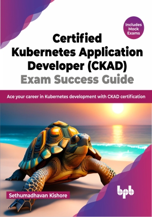

# Certified Kubernetes Application Developer (CKAD) Exam Success Guide

Learn all skills needed to be a Certified Kubernetes professional

This is the repository for [Certified Kubernetes Application Developer (CKAD) Exam Success Guide
](https://bpbonline.com/products/certified-kubernetes-application-developer-ckad-exam-success-guide?variant=42896941973704),published by BPB Publications.

## About the Book
Want to become a Certified Kubernetes Application Developer (CKAD)? If you're looking to take your Kubernetes skills to the next level, then you need this book.

This comprehensive and easy-to-read guide is perfect for aspiring Kubernetes developers and seasoned professionals alike. It covers everything you need to know to confidently prepare for and pass the CKAD certification exam. It starts with the basics of Kubernetes, Docker, and Minikube, and then progresses to more advanced topics such as deployment strategies, pod design, networking, security, monitoring, volume, probes and more. It even includes two full scale mock exams to help you practice for the real CKAD exam. 

By the end of the book, you will have the knowledge and skills you need to excel in deploying and managing containerized applications in Kubernetes environments and should feel confident to appear for the CKAD exam.

## What You Will Learn
•  Prepare you for Certified Kubernetes Application Developer CKAD exam.

•  Dive deep into Kubernetes and its core and advanced concepts.

•  Explore the various kubectl commands that are essential for passing the CKAD exam.

•  Learn Tips and tricks and best practices to pass the CKAD exam.

•  Learn how to deploy, manage, monitor and troubleshoot  Kubernetes applications.

•  Lots of real CKAD exam-like questions including mock exam for you to practice and to assess your knowledge and identify areas where you need to improve.
